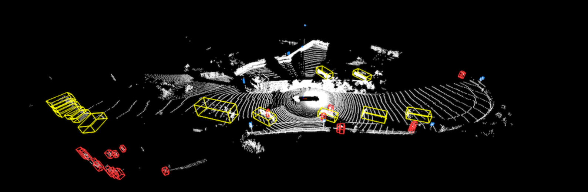

# Writeup: 3D Object Detection

## Object: 
**Ths mid-term project for Sensor Fusion consists of using a deep-learning approach to perform object detection of vehicles in LiDAR data, utilizing a birds-eye view perspective of the 3D point-cloud. Additionally, the performance of the detection approach is evaluated using a series of performance measures.**

In total, four steps were implemented to complete the project. In the following, each step will be discussed and explained separately.

# Step 1: Compute Lidar point cloud from Range Image

### Display Range Image

In this step the function `show_range_image` is implemented.
This task involves extracting two data channels, "range" and "intensity," from the range image and converting the floating-point data to an 8-bit integer value range. The data's complete range is correctly mapped onto the OpenCV image's 8-bit channels, ensuring that no data is lost. Objects of interest, such as vehicles in the intensity image, appear with a decent value approximately in the middle of the 8-bit range.

Example of a Range Image: 

### Display Point Cloud
In this step the function `show_pcl` is implemented. 
The Open3D library is used to display the lidar point-cloud in a 3D viewer, enabling the development of an intuitive understanding of the nature of lidar point-clouds.

Examples of Point Cloud Images: 
<table style="width:100%">
  <tr>
    <td></td>
    <td></td>
  </tr>
  <tr>
    <td></td>
    <td></td>
  </tr>
  <tr>
    <td></td>
    <td></td>
  </tr>
  <tr>
    <td></td>
    <td></td>
  </tr>
  <tr>
    <td></td>
    <td></td>
  </tr>
</table>

The tail lights and rear bumper are primarily considered as stable features, while the headover lights, car front lights, and rear window shields are sometimes included as additional features. These features are identified through the intensity channels. From a lidar perspective, the car chassis is the most prominent identifiable feature. The images are analyzed using different settings, and the rear lights are the most stable components. Additionally, the bounding boxes assigned to the cars (used from Step-3) are correctly identified.

# Step 2: Create Birds-Eye View from Lidar PCL

### Convert sensor coordinates to BEV-map coordinates

In this step the function `bev_from_pcl` is implemented.
The aim of this task is to execute the initial step in generating a birds-eye view (BEV) perspective of the lidar point-cloud. This involves computing the corresponding coordinates within the BEV coordinate space based on the (x,y)-coordinates in sensor space. By completing this task, the BEV map can be filled with lidar data from the point-cloud in subsequent tasks.

A sample preview of the BEVs:
<table style="width:100%">
  <tr>
    <td></td>
    <td></td>
  </tr>
</table>

### Compute intensity layer of the BEV map
The objective of this task is to populate the "intensity" channel of the BEV map with data from the point-cloud. This entails identifying all points with identical (x,y)-coordinates within the BEV map and then assigning the intensity value of the topmost lidar point to the respective BEV pixel. The "height" channel of the BEV map is also filled with data from the point-cloud and each BEV map pixel is normalized by the difference between max and min. height.

Examples for Intensity Channel: 

<table style="width:100%">
  <tr>
    <td></td>
    <td></td>
  </tr>
</table>

Examples of corresponding normalized Height Channel:

<table style="width:100%">
  <tr>
    <td></td>
    <td></td>
  </tr>
</table>

# Step 3: Model Based Object Detection in BEV Image
### Add a second model from a GitHub repo
The goal of this task is to illustrate how a new model can be integrated into an existing framework. 
The task consists of the following substeps:
- Clone the repo Super Fast and Accurate 3D Object Detection based on 3D LiDAR Point Clouds
- Understand the steps involved for performing inference with a pre-trained model
- Extract the and analyse the relevant parameters of the model
- Istantiate the model for `pn_resnet`
- Perform inference and decode the output and perform post-processing
- Visualize the results

### Extract 3D bounding boxes from model response 
The model input is a three-channel BEV map, and the detected objects are returned with coordinates and properties in the BEV coordinate space. However, before the detections can progress through the processing pipeline, they must be transformed into metric coordinates in the vehicle space. This task involves converting the detections into the required format `[1, x, y, z, h, w, l, yaw]`, where 1 represents the class id for the object type "vehicle".

Example images with Bounding Boxes:

# Step4: Performance detection for 3D Object Detection
### Compute intersection-over-union between labels and detections
The aim of this task is to establish associations between ground-truth labels and detections in order to determine if an object has been (a) missed (false negative), (b) successfully detected (true positive), or (c) falsely reported (false positive). Using the labels in the Waymo Open Dataset, the geometric overlap between the bounding boxes of the labels and detected objects are computed and the overlap percentage with respect to the bounding box area is determined. The the `intersection over union` method is implemented, which is a commonly used approach in the literature to calculate this value.

### Compute precision and recall
After processing all the frames of a sequence, the performance of the object detection algorithm is evaluated. This is done using standard measures such as "Precision" and "Recall". 
- *Precision*: The probability that an object found by the algorithm actually corresponds to a real object.
- *Recall*: The probability for a real object to be found by the detector.
The evaluated model shows the following performance: 
`precision = 0.954`,
`recall = 0.834`

After setting the flag `configs_det.use_labels_as_objects`  to `True` the resulting performance measures are as follows:
`precision = 1.0`,
`recall = 1.0`
In case of using the groud
