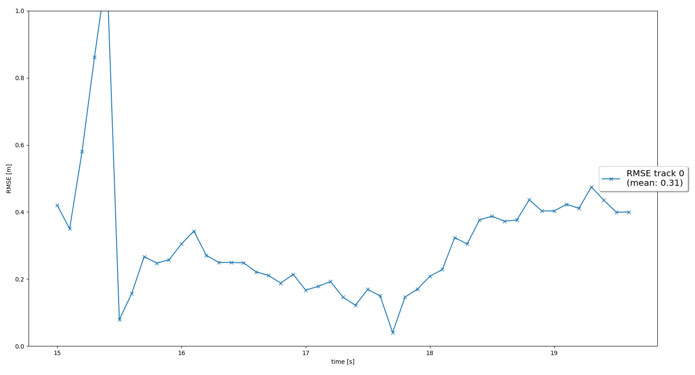
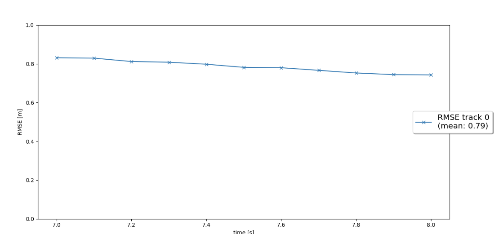
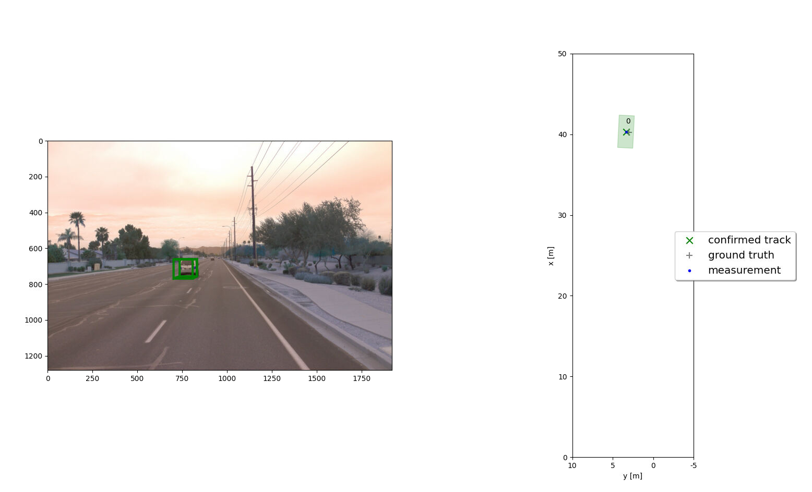
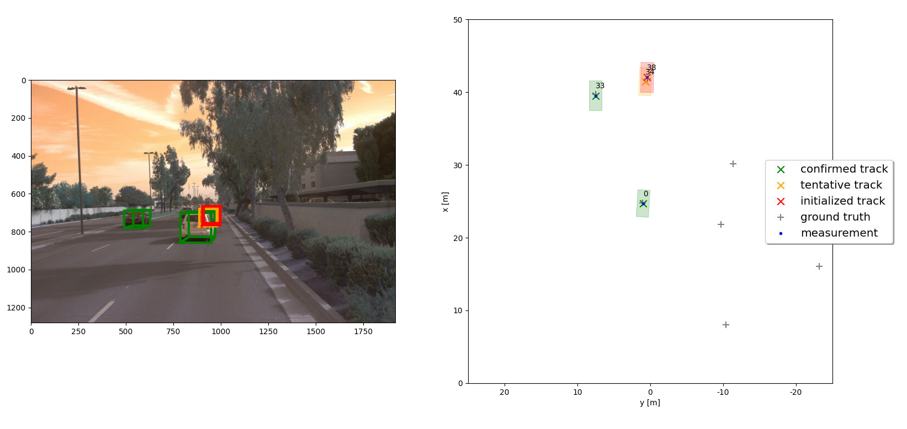
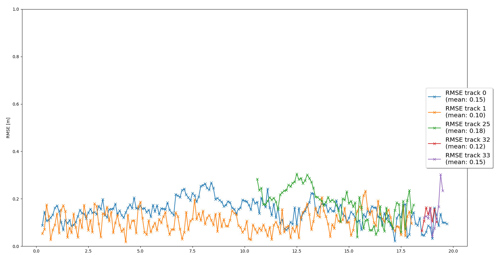

# Writeup:  Sensor Fusion and Object Tracking

## Object: 
**Ths final project for Sensor Fusion consists of using a Kalman Filter algorithm to perform vehicle tracking over time with real-world camera and lidar measurements.**
In total, the following steps were implemented to complete the project. 

 - Implement an extended Kalman filter.
 - Implement track management including track state and track score, track initialization and deletion.
 - Implement single nearest neighbour data association and gating.
 - Apply sensor fusion by implementing the nonlinear camera measurement model and a sensor visibility check.

In the following, each step will be discussed and explained separately.

The *RMS*E is used to analyset the performance of tracking algorithm: 
**RMSE** stands for *Root Mean Squared Error*. It is a commonly used measure of the difference between the predicted values and the actual values. It is calculated by taking the square root of the average of the squared differences between the predicted and actual values. The RMSE is a measure of the accuracy of a model and is often used in regression analysis and time series analysis. The lower the RMSE, the better the model is at predicting the values.

# Step 1:  Implement an extended Kalman filter

The task is to implement the `predict` and `update` functions for an EKF in `filter.py`.

- The *system matrix* for a constant velocity process model in 3D  and the corresponding *process noise covariance* based on the current time step *dt* are calculated.
- The *measurement function* is evaluated at the current state `h(x)` ,

In this step the function `show_range_image` is implemented.
This task involves extracting two data channels, "range" and "intensity," from the range image and converting the floating-point data to an 8-bit integer value range. The data's complete range is correctly mapped onto the OpenCV image's 8-bit channels, ensuring that no data is lost. Objects of interest, such as vehicles in the intensity image, appear with a decent value approximately in the middle of the 8-bit range.

The following Image illustrates the RMSE for single tracking: 

# Step 2: Track Management

In this step track management is implemeneted, so that tracks can be initialized and deleted. A track state and a track score can also be set.

The visualization demonstrates the automatic initialization of a new track at the location of unassigned measurements, quick confirmation of the true track, and deletion of the track when it is no longer visible.The `RMSE` plot displays a single line since there is only one track with no losses.

# Step 3: Data Association
In this step a *single nearest neighbor* data association is implemented to associate measurements to tracks.

The following steps are taken to associate tracks with measurements:

- A matrix is created with all tracks and open measurements.
- The Mahalanobis distance is calculated for each track-measurement pair.
- To eliminate unlikely track-measurement pairs, the Chi-Square hypothesis test is used.
- The pair with the smallest Mahalanobis distance is selected, the Kalman filter is updated, and the corresponding row and column in the association matrix are deleted.
- A measurement is considered to belong to a track if the Mahalanobis distance is less than the threshold obtained from the inverse cumulative chi-squared distribution.

# Step 4: Camera Sensor fusion

In this step the nonlinear camera measurement model is implemented. The camera-lidar fusion can be now performed..
The tracking loop now updates all tracks with lidar measurements, then with camera measurements. The console output shows lidar updates followed by camera updates. The visualization shows that the tracking performs well. The `RSME` plot shows that track 0 are tracked from beginning to end of the sequence without track loss. The mean `RMSE` for these two tracks is be below 0.25.

# Conclusion: 
In this project there were four main tracking steps, which are as follows:

- **Extended Kalman Filter (EKF):** This step uses the EKF algorithm to estimate the position and velocity of each tracked object using measurements from lidar and radar sensors. The EKF algorithm allows us to handle non-linear motion models and non-Gaussian noise.

- **Track Management:** This step keeps track of all the objects in the scene and assigns unique IDs to each object. It also predicts the state of each object in the absence of new measurements and removes objects that are no longer visible.

- **Data Association:** This step associates lidar and camera measurements with existing object tracks. It uses the Hungarian algorithm to find the optimal assignment of measurements to tracks.

- **Camera-Lidar Sensor Fusion:** This step fuses measurements from lidar and camera sensors to get a more accurate estimate of the object's position, velocity, and orientation. The fusion is done using the Unscented Kalman Filter (UKF) algorithm.

All required steps for tracking were implemented and good results on the test data provided were achieved. All parts were challenging since alls tasks require a good understanding of linear algebra, geometry, complex EKF algorithm etc.

There are several benefits to camera-lidar fusion compared to lidar-only tracking. First, camera measurements can provide additional information about an object's orientation, which can be useful for predicting its future motion. Second, camera measurements can help distinguish between objects with similar shapes and sizes but different colors or textures. Third, camera measurements can provide more accurate distance estimates for objects that are close to the vehicle.

A sensor fusion system can face several challenges in real-life scenarios. One of the main challenges is sensor calibration, which is essential to ensure that measurements from different sensors are aligned correctly. Another challenge is dealing with sensor failures or errors, which can lead to incorrect object tracking. Finally, a sensor fusion system must be able to handle dynamic scenes with multiple moving objects and changing environmental conditions, such as lighting and weather.

There are several ways to improve the tracking results in the future. One possible approach is to incorporate additional sensors, such as radar or GPS, to provide more information about the environment and improve the accuracy of object tracking. Another approach is to use more sophisticated data association algorithms, such as deep learning-based methods, to handle complex scenes with a large number of objects. Finally, improving the sensor calibration process can lead to more accurate measurements and better tracking results.
